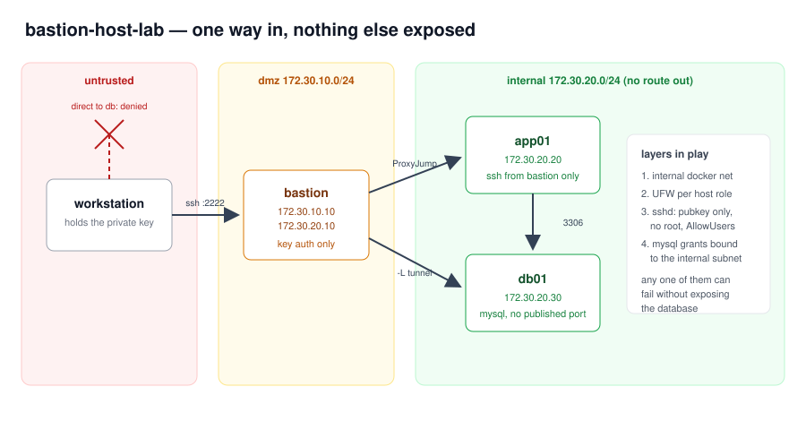

# Bastion host lab

[](https://github.com/Alex-2rios/bastion-host-lab/actions/workflows/ci.yml)

A three host network where exactly one machine is reachable from outside, and everything else
lives on a subnet with no route to the internet. Built with Docker Compose so I could break it,
fix it and rebuild it in seconds instead of reinstalling VMs.



The full step by step is in [docs/walkthrough.md](docs/walkthrough.md). This page is the summary.

## The idea

A bastion (or jump host) is the single audited entry point into a private network. Admins SSH
into it, and from there into everything else. Nothing else accepts connections from the outside
at all. It is a boring, old pattern and it is still how most sane infrastructure is laid out.

I wanted to build one properly rather than just read about it, including the parts that are easy
to get wrong:

- the private key never leaves my workstation, `ProxyJump` forwards the channel instead
- the database has no published port, you reach it through an SSH tunnel or not at all
- MySQL grants are pinned to the internal subnet, so stolen credentials are not enough by themselves
- root login and password authentication are off on both hosts

## Layout

| Host | Address | Reachable from |
|---|---|---|
| `bastion` | 172.30.10.10 and 172.30.20.10 | my machine, on port 2222 |
| `app01` | 172.30.20.20 | bastion only |
| `db01` | 172.30.20.30 | app01 and bastion only |

The `internal` network is declared `internal: true`, which means Docker gives it no gateway.
Containers on it cannot reach the internet and the host cannot reach them directly.

## Quick start

```bash
./scripts/setup-keys.sh
docker compose up -d --build
ssh -i ssh/lab_key -p 2222 jump@127.0.0.1
```

`setup-keys.sh` prints the `~/.ssh/config` block that turns the rest into one word each:

```bash
ssh lab-app
ssh -L 3307:172.30.20.30:3306 -N lab-bastion
```

## Proving it actually works

```bash
./scripts/verify-isolation.sh
```

```
  [ ok ]   host    -> bastion ssh, the one published port     reachable
  [ ok ]   host    -> mysql directly                          blocked
  [ ok ]   host    -> app ssh directly                        blocked
  [ ok ]   bastion -> app ssh                                 reachable
  [ ok ]   bastion -> db mysql                                reachable
  [ ok ]   app     -> db mysql                                reachable
  [ ok ]   app     -> the internet                            blocked
  [ ok ]   db      -> the internet                            blocked

passed 8, failed 0
```

Half of those checks are asserting that something does **not** work. Writing the negative tests
was the useful part. It is easy to build a network that works and never notice you also left the
database open to the world.

## On real servers

Two ways to apply this to actual machines.

The quick one, `scripts/ufw-rules.sh`, applies one of three UFW profiles (`bastion`, `app`, `db`)
to an Ubuntu host. The database profile denies outbound traffic by default and only allows DNS
out, so a compromised database host cannot phone home.

The one I would use for more than one server is the Ansible playbook in `ansible/`, which does
the whole thing per role: creates the service account, installs the authorised key, renders the
right sshd config, applies the firewall rules, sets up fail2ban and turns on unattended security
upgrades.

```bash
cd ansible
cp inventory.example.yml inventory.yml
ansible-playbook --syntax-check playbook.yml
ansible-playbook playbook.yml --check
ansible-playbook playbook.yml
```

Two details in there worth pointing at. The sshd template is written through
`validate: /usr/sbin/sshd -t -f %s`, so a config that would refuse to start never reaches the
file, which matters when the config you are replacing is the one holding your session open. And
the inventory reaches the internal hosts through `ProxyJump` on the bastion, so Ansible itself
follows the same path as a human, with no direct route to those machines.

## What I learned

- Docker's port publishing writes iptables rules underneath UFW, so a published port is open
  even when `ufw status` swears it is denied. Binding to `127.0.0.1:port:port` is the fix. This
  one cost me an afternoon and it is the most useful thing in this repo.
- `AllowTcpForwarding yes` on the bastion is required for `ProxyJump` to work, but it stays off
  on the app server. A jump host needs forwarding, an application server almost never does.
- A user created with `useradd` and no password is *locked*, and sshd refuses it before it even
  looks at your key. The log line is `User jump not allowed because account is locked`, and the
  fix is `usermod -p '*'`, which means "no password will ever match" rather than "disabled".
  Key authentication then works exactly as intended.
- `ssh -J bastion -i key target` does not do what it looks like. `-i` applies to the destination,
  so the hop authenticates with your default identities and fails first. Either put
  `IdentityFile` per host in `~/.ssh/config`, or spell out the `ProxyCommand`.
- A bind mounted `authorized_keys` comes in with host ownership and permissions that sshd rejects
  under `StrictModes`. Rather than turning StrictModes off, the entrypoint copies the mounted key
  into place with the right owner and mode before sshd starts.
- `ufw limit` instead of `ufw allow` for SSH rate limits repeated attempts from one source and
  costs nothing to turn on.
- Network isolation and database grants overlap on purpose. `appuser@172.30.20.%` means that
  even if the tunnel leaked, the credentials only work from inside the subnet.
- `ufw --force reset` on a remote host with a single SSH session open is how people lock
  themselves out of production. Second session first, always.

## Working on this

```bash
make help
```

The usual ones: `make up, make verify, make shell, make ansible-check, make down`.

Every push runs the CI workflow described above. A second workflow, `security.yml`, runs weekly
and on every push: it scans the history for committed secrets with gitleaks, scans both images
with Trivy, and checks the compose file for misconfiguration.

Dependabot opens pull requests for the GitHub Actions and the dependencies once a week.

Line endings are pinned to LF through `.gitattributes`, because half of this was written on
Windows and shell scripts with carriage returns fail on Linux in a way that is genuinely
confusing the first time.

## Next

Session recording on the bastion, so there is an audit trail of what was actually done through
it, and a second jump host in another location so maintenance on the first one does not lock
everyone out.
